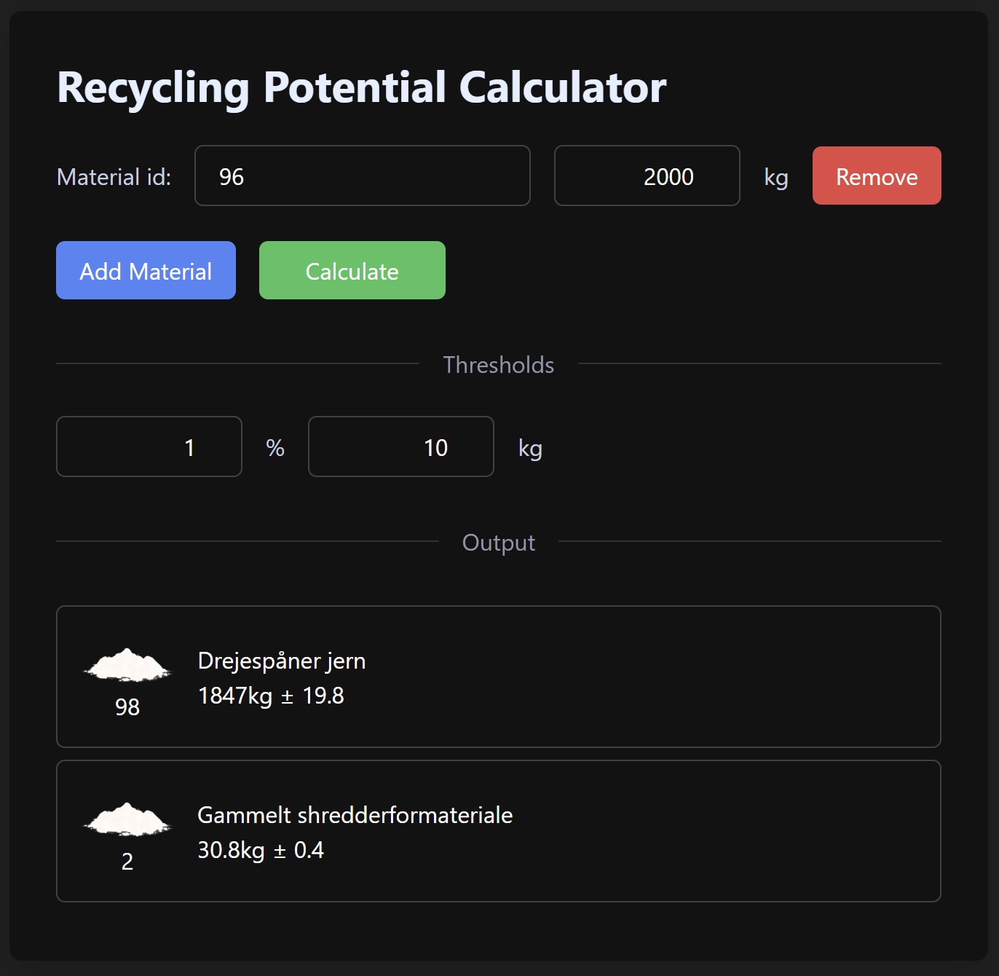

# garbage-in-out

<div align="center">
    
    
    🚀 **Turn Your Trash into Algorithmic Gold!** 🚀
</div>

# 🗑️ Garbage in - treasure out? 
Welcome to the cutting-edge frontier of waste prediction! This revolutionary repository harnesses the power of neural networks to transform mundane waste data into precious insights. Like an alchemist of the digital age, our models transmute raw garbage metrics into golden predictions!

## 🤖 What's Inside This Treasure Chest?
This repository houses two sophisticated neural network models that predict recycling facility outputs:
1. **The Total Oracle**: Predicts the total output of useable materials
2. **The Content Prophet**: Forecasts the precise composition of output materials

## 🛠️ Magical Dependencies
* 🔢 Numpy - For numerical sorcery
* 🔥 Pytorch - Our neural enchantment engine
* 📊 Seaborn - To visualize the transformation

## Example
```python
# Example usage - Total output prediction
from inference import predict_output, create_input_tensor

input_ids = [
    11, # Old iron
    656, # Old iron with impurities
]

input_amounts = [
    1435, # kg
    2390, # kg
]

input_vector = create_input_tensor(input_ids, input_amounts)
result = predict_output(input_vector)

print(f"Predicted total output: {result[1]:.2f} tons of {result[0]:.2f}")
>>>> "Predicted total output: 3.825 tons of shredder material"
```

## 💻 Sleek Interface
Check out our intuitive interface that makes waste prediction a breeze! With simple input fields and real-time updates, you'll be analyzing waste patterns like a pro.

<div align="center">
    
</div>